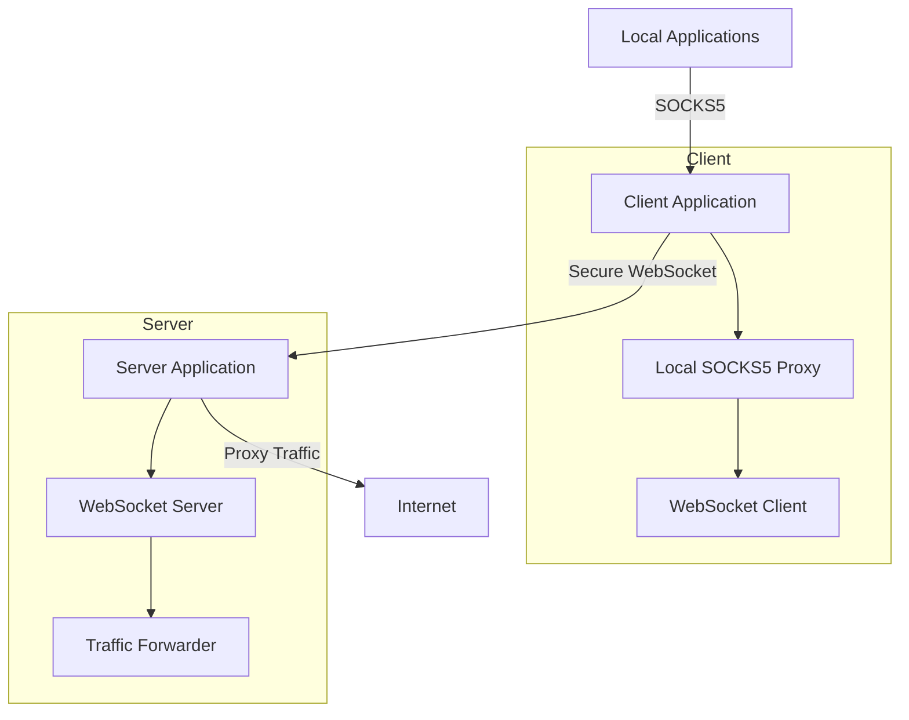

# Anti-Filter Bridge - Architecture

## System Overview

Anti-Filter Bridge is designed as a client-server application that creates secure tunnels through restricted networks using WebSockets. The system consists of several key components that work together to provide a reliable and secure tunneling solution.

## High-Level Architecture

## Components

### 1. Client Component

#### 1.1 Local SOCKS5 Proxy
- Listens on a local port
- Handles SOCKS5 protocol
- Forwards traffic to WebSocket client

#### 1.2 WebSocket Client
- Establishes secure connection to server
- Encrypts/decrypts traffic
- Handles reconnection logic

#### 1.3 Configuration Manager
- Manages client configuration
- Handles authentication tokens
- Stores connection settings

### 2. Server Component

#### 2.1 WebSocket Server
- Listens for incoming connections
- Manages client authentication
- Routes traffic between clients and destinations

#### 2.2 Traffic Forwarder
- Forwards traffic to destination servers
- Handles DNS resolution
- Implements traffic shaping and QoS

#### 2.3 Monitoring Service
- Tracks connection statistics
- Implements rate limiting
- Generates usage reports

## Data Flow

1. **Connection Establishment**
   - Client authenticates with server using token
   - Secure WebSocket connection is established
   - SOCKS5 proxy starts listening on local port

2. **Traffic Flow**
   - Local application connects to SOCKS5 proxy
   - Proxy forwards traffic through WebSocket tunnel
   - Server receives and forwards traffic to destination
   - Response follows reverse path back to application

## Security Architecture

### Encryption
- TLS 1.3 for all communications
- Strong cipher suites (AES-256-GCM, ChaCha20-Poly1305)
- Certificate pinning

### Authentication
- JWT-based authentication
- Token rotation
- IP whitelisting/blacklisting

### Isolation
- Process isolation between connections
- Resource limits per connection
- Sandboxed execution environment

## Performance Considerations

### Connection Pooling
- Reuse of WebSocket connections
- Connection multiplexing
- Keep-alive mechanisms

### Resource Management
- Memory-efficient buffer handling
- Asynchronous I/O operations
- Connection timeouts and cleanup

## Scalability

### Horizontal Scaling
- Stateless design allows for easy scaling
- Load balancing support
- Distributed deployment options

### Caching
- DNS response caching
- Connection state caching
- Frequently accessed resource caching

## Monitoring and Logging

### Metrics Collection
- Connection statistics
- Bandwidth usage
- Error rates

### Alerting
- Anomaly detection
- Resource threshold alerts
- Security event notifications

## Deployment Architecture

### Single-Node Deployment
- Suitable for small-scale deployments
- All components on a single server
- Simple setup and maintenance

### Multi-Node Deployment
- Load balancer in front of multiple server instances
- Shared database for session state
- Distributed logging and monitoring

## Failover and Redundancy

### High Availability
- Active-passive server setup
- Automatic failover
- State synchronization

### Data Backup
- Regular configuration backups
- Secure storage of backup data
- Recovery procedures
