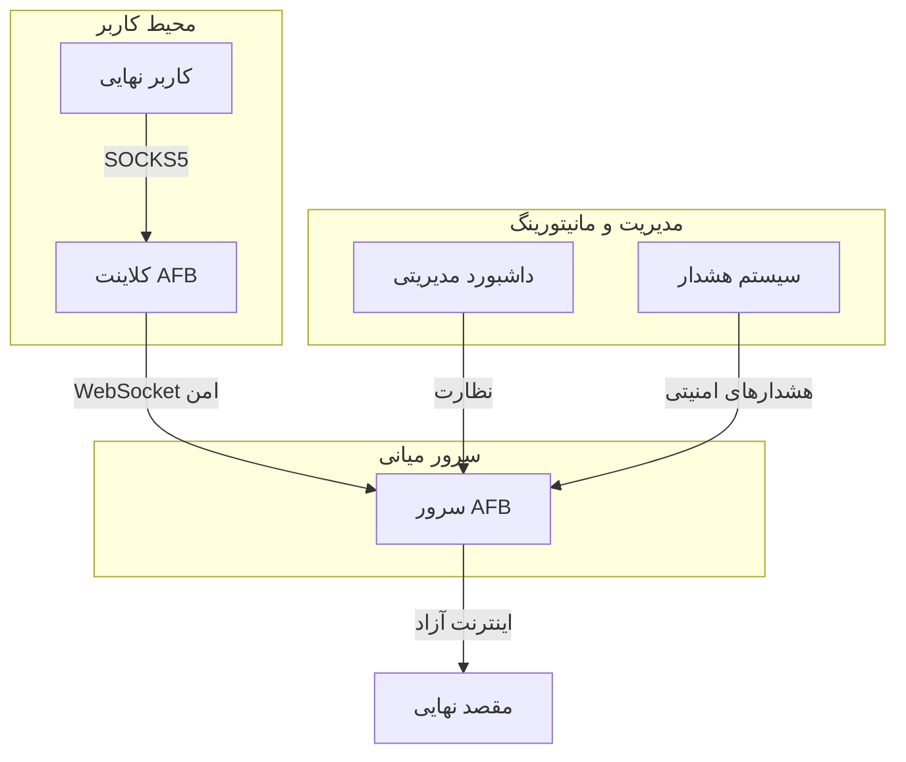

# مشخصات پروژه: Anti-Filter Bridge (وضعیت کنونی - ۱۴۰۳/۰۷/۰۷)

## هدف
توسعه یک راه‌حل جامع و پایدار برای عبور از فیلترینگ با استفاده از فناوری‌های پیشرفته و امن

## دامنه پروژه
- **تمرکز**: ایجاد یک پلتفرم امن و قابل اعتماد برای تونل‌زنی
- **حوزه تحت پوشش**:
  - مرور وب به صورت امن و ناشناس
  - دسترسی به سرویس‌های مسدود شده
  - محافظت از حریم خصوصی
- **پلتفرم‌های پشتیبانی شده**:
  - ویندوز (Windows 10/11)
  - لینوکس (Ubuntu/Debian/CentOS)
  - مک‌اواس (macOS 10.15+)

## ویژگی‌های پیاده‌سازی شده

### امنیت
- [x] اتصال امن WebSocket با TLS 1.3
- [x] رمزنگاری پیشرفته ترافیک
- [x] احراز هویت توکن‌محور
- [x] محدودیت نرخ درخواست (Rate Limiting)

### عملکرد
- [x] پشتیبانی از SOCKS5
- [x] مدیریت خودکار اتصالات
- [x] بازیابی خودکار از قطعی
- [x] مانیتورینگ لحظه‌ای

### قابلیت‌های مدیریتی
- [x] رابط خط فرمان (CLI) پیشرفته
- [x] نصب به عنوان سرویس سیستمی
- [x] تولید خودکار تنظیمات
- [x] لاگ‌گیری جامع

### مستندات
- [x] راهنمای نصب و راه‌اندازی
- [x] مستندات فنی
- [x] مثال‌های کاربردی

## محدودیت‌های فعلی
- نیاز به تنظیم دستی گواهی‌های امنیتی
- عدم پشتیبانی از IPv6
- نیاز به بهبود مستندات فارسی

## فناوری‌های استفاده شده

### زبان‌ها و فریم‌ورک‌ها
- **زبان اصلی**: Python 3.9+
- **وب‌سوکت**: `websockets`
- **رابط خط فرمان**: `click`
- **وب‌سرور**: `FastAPI` + `uvicorn`
- **رابط کاربری وب**: `Jinja2` + `Bootstrap`

### امنیت
- **رمزنگاری**: `cryptography`
- **احراز هویت**: JWT
- **حفاظت**: Rate Limiting, CORS, CSRF

### مانیتورینگ و مدیریت
- **نظارت**: `psutil`
- **لاگ‌گیری**: `logging`
- **مدیریت فرآیند**: `python-daemon`

## دستاوردها و معیارهای موفقیت

### معیارهای فنی
- **پایداری**: اتصال پایدار به مدت 7 روز بدون قطعی
- **کارایی**: تاخیر کمتر از 300ms برای درخواست‌های معمولی
- **مصرف منابع**: حداکثر 100MB رم و 5% CPU در حالت عادی
- **امنیت**: عبور از تست‌های امنیتی اولیه

### معیارهای کیفی
- **سهولت استفاده**: راه‌اندازی در کمتر از 5 دقیقه
- **مستندات**: پوشش بیش از 90% قابلیت‌ها
- **جامعه کاربری**: استقبال اولیه مثبت کاربران آزمایشی

## معماری فعلی سیستم

## برنامه زمانی و مراحل بعدی

### فاز جاری: پایدارسازی (۲ هفته آینده)
- [ ] بهینه‌سازی مصرف منابع
- [ ] بهبود مستندات
- [ ] رفع مشکلات جزئی

### فاز بعدی: توسعه ویژگی‌های جدید
- [ ] پشتیبانی از IPv6
- [ ] توسعه رابط کاربری تحت وب
- [ ] افزودن قابلیت‌های مدیریتی پیشرفته

### چشم‌انداز بلندمدت
- [ ] توسعه اپلیکیشن موبایل
- [ ] پشتیبانی از پروتکل‌های بیشتر
- [ ] ایجاد شبکه توزیع‌شده از سرورها
